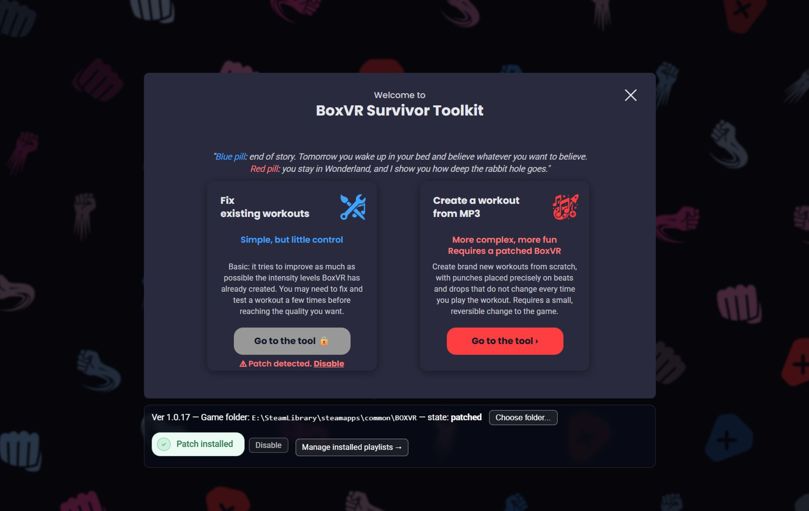
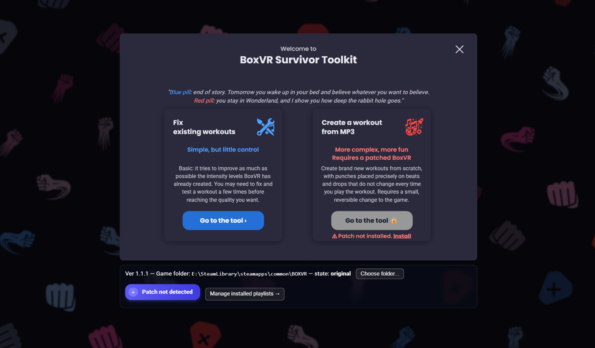
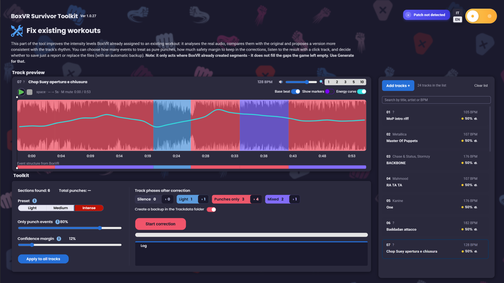
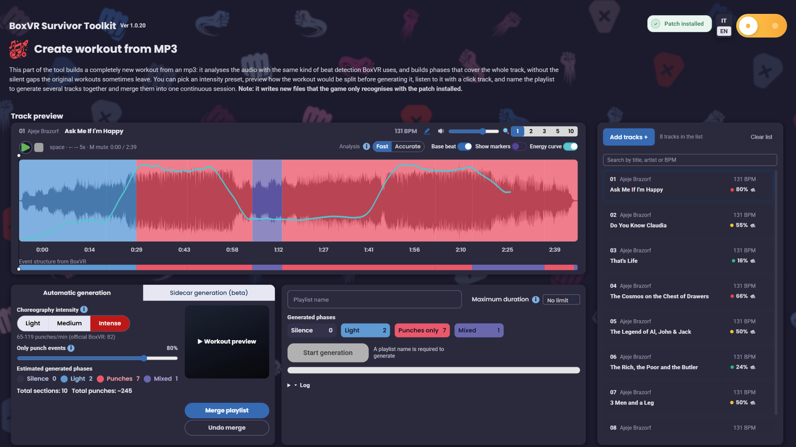
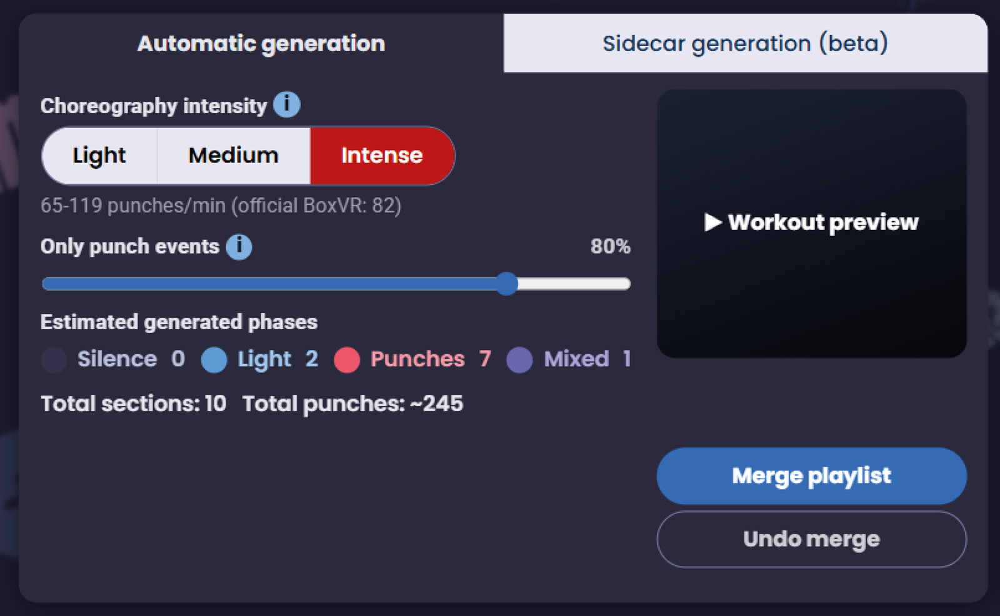
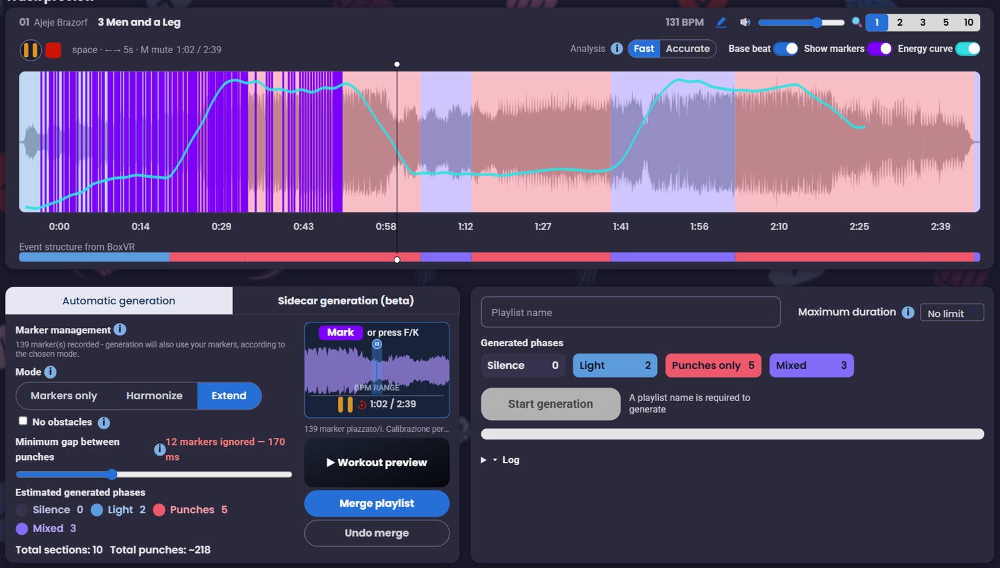
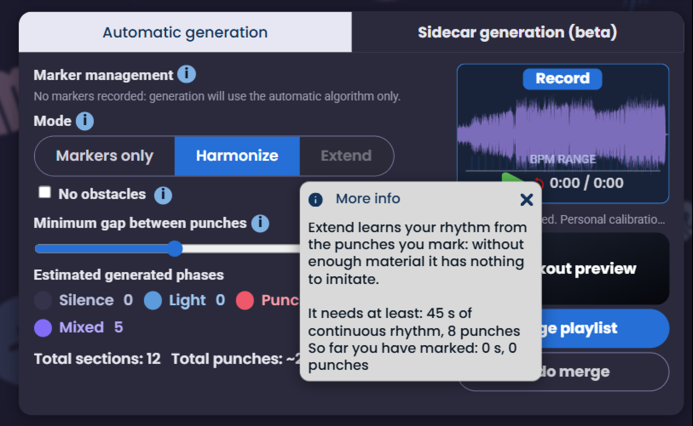
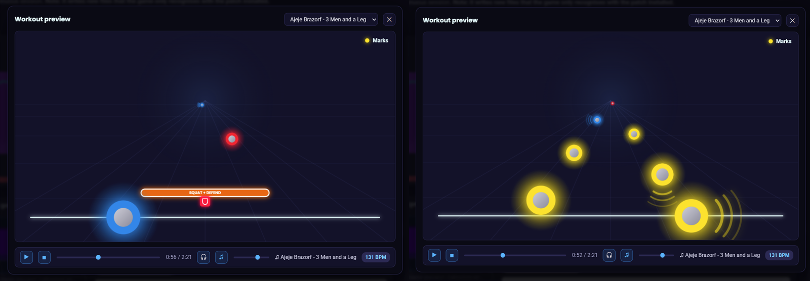

# BoxVR Survivor Toolkit

Build and repair custom **BoxVR** (FitXR) workouts on PC, starting from your
own MP3s.

*[Leggi in italiano](README.it.md)*

> **Unofficial modding project.** Not affiliated with, sponsored by, or
> endorsed by FitXR. "BoxVR" and related marks belong to their respective
> owners. Read [Warnings](#warnings) before using it.

*The opening screen, with the patch (top) and without (bottom). **Only one of
the two doors is open at a time**, and the game patch decides which. **Fix**
works on the intensity levels BoxVR itself wrote, so it is locked while the
patch is active — with the patch the game reads the explicit choreography
instead, and those levels no longer decide anything. **Generate** is the
mirror image: the choreography it writes is only read by a patched game, so
without the patch it stays locked and offers to install it, rather than
letting you generate a workout that would never reach VR.*

---

## What it does

BoxVR can import your own songs, but the result is often disappointing: the
game analyses the track on its own, and the map it produces can be flat where
the music is loud, or leave stretches where nothing happens at all. This
toolkit works on exactly that, in three ways.

| tool | what it does | needs the patch? |
|---|---|---|
| **Fix** | re-reads the audio of a song the game already imported and repairs the wrong intensity levels | no |
| **Generate** | builds a brand new track from an MP3, with full coverage and no gaps | **yes** |
| **Playlist manager** | rename, reorder and clean up already installed playlists | no |

*__Fix__. The waveform is the real audio; the coloured bands are the phases BoxVR assigned, and the cyan line is the energy the tool measured. Where the two disagree is where the workout feels wrong.*

*__Generate__. Same preview, but here the phases are built from scratch and cover the whole track. The counters under the intensity slider are the real count of what will be generated, not an estimate that drifts.*

*The generation panel. The preset picks the move repertoire and the target cadence — measured against the game's own workouts, which average 82 punches per minute.*

And, inside Generate:

- **Sidecar** — tap out the punches you want yourself, and the tool builds the
  workout around yours.
- **Workout preview** — watch the choreography scroll past before putting the
  headset on.

*__Sidecar__. The purple lines are punches tapped by hand while the track
plays. Three modes decide what happens next: keep only yours, weave them into
the generated ones, or learn your rhythm and carry it through the rest of the
track.*

*__Extend__ stays off until it has something to learn from. It imitates the
cadence and the rhythm of the punches you marked, and a handful of taps is not
a rhythm — so instead of quietly falling back to a generic workout under a
name that promises otherwise, the button says what it needs and how far along
you are.*

*__Workout preview__. The choreography, before the headset: punches arriving on the beat, obstacles to duck or block, and the yellow marks showing where your own punches landed.*

---

## Getting started

1. Download the latest build from [Releases](../../releases).
2. You need the **Microsoft Edge WebView2 Runtime** (normally already present
   on Windows 10/11; if it is missing, the app says so and points you to it).
3. Run the executable. No installation, and it touches nothing until you ask
   it to.

To run from source, see [docs/contributing.md](docs/contributing.md).

---

## Documentation

| document | topic |
|---|---|
| [How BoxVR works](docs/boxvr-and-fix.md) | the `trackdata` format, why levels come out wrong, what **Fix** does |
| [Generate](docs/generate.md) | track analysis, BPM, the librosa/madmom engines, the generation algorithm, exporting |
| [Sidecar](docs/sidecar.md) | marking punches by hand and making them coexist with generated ones |
| [Tuning the algorithm](docs/tuning.md) | the sliders that change how a workout feels, and how to share a setting |
| [The game patch](docs/patch.md) | why it is needed, exactly what it changes, how to undo it |
| [Playlist manager](docs/playlist-manager.md) | the separate tool for installed playlists |
| [Project history](docs/history.md) | where it started, how it got here |
| [The role of AI](docs/ai.md) | how much of this code an AI wrote, and how |
| [Third-party licences](THIRD_PARTY_NOTICES.md) | every bundled library, font and sound, with its licence |
| [Contributing](docs/contributing.md) | running from source, the test suites, how the pages are composed |
| [Changelog](CHANGELOG.md) | what changed in each version, and how it was measured |

Italian versions of all of the above live in [`docs/it/`](docs/it/).

---

## Warnings

**Back up your BoxVR library before using anything that writes into the
game.** The tool makes its own backup, but your own backup is a different
thing.

- **The tool writes into the BoxVR data folder** only when you explicitly ask
  it to, and it shows you what it is about to do first.
- **The patch modifies a game file** (`Assembly-CSharp.dll`). It is reversible
  two independent ways: the tool keeps a timestamped backup, and Steam's
  "Verify integrity of game files" restores the original at any point. See
  [docs/patch.md](docs/patch.md).
- **Do not redistribute generated files containing someone else's music.** The
  tool also produces a `.wav` of your track: that is your copy of your music,
  and it should stay that way.
- **Mostly tested with high-BPM workouts.** On slower tracks the result is
  less proven.

---

## Licence

**GNU General Public License v3.0** — see [LICENSE](LICENSE).

    BoxVR Survivor Toolkit
    Copyright (C) 2026 Luca Giuseppe Buttacavoli

    This program is free software: you can redistribute it and/or modify it
    under the terms of the GNU General Public License as published by the
    Free Software Foundation, either version 3 of the License, or (at your
    option) any later version.

    This program is distributed in the hope that it will be useful, but
    WITHOUT ANY WARRANTY; without even the implied warranty of
    MERCHANTABILITY or FITNESS FOR A PARTICULAR PURPOSE. See the GNU General
    Public License for more details.

In plain terms: use it, change it, share it. If you distribute it — modified
or not — you must pass on the source under the same licence. Nobody gets to
close it up inside a proprietary product.

Third-party libraries, fonts and sounds carry their own licences, listed in
[THIRD_PARTY_NOTICES.md](THIRD_PARTY_NOTICES.md); all of them are compatible
with the GPL.

**What is deliberately NOT in this repository:** any BoxVR data. Not the
tracks, not the official maps, not the game's pattern repertoire, not the
assemblies. That material belongs to FitXR. Where the tool needs it, it
extracts it from **your** legitimate copy of the game using the included
extractor — that is how modding works without redistributing someone else's
work.

---

## About the AI

Most of this code and interface was written by a large language model (Claude,
Anthropic) under the author's direction, over weeks of work sessions. That is
not a detail to bury in a footnote: see [docs/ai.md](docs/ai.md) for what it
means in practice, what was verified and how, and where the limits are.
