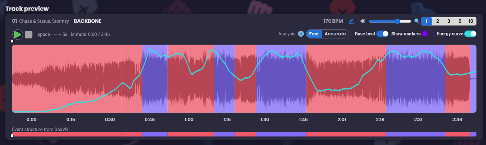

# Generate: building a workout from an MP3

*[Versione italiana](it/genera.md)*

Where [Fix](boxvr-and-fix.md) repairs what the game already produced,
**Generate** starts from an audio file and builds the analysis from scratch —
with a guarantee the game does not give: **full coverage of the song, no
gaps**, because the tool draws the segments itself and makes them meet by
construction.

---

## 1. The song list

You drop in a folder of MP3s or WAVs, and each track appears with artist,
title and BPM. Metadata comes from the file's tags; if they are missing, it
falls back to the filename.

Analysis of each track starts **in the background** as soon as it enters the
list. That is a deliberate choice: analysing a track takes seconds, and
freezing the interface while it happens would make the tool unusable with a
full folder. Until the analysis is ready, the controls that depend on it stay
disabled and say so, rather than showing invented numbers.

---

## 2. The track timeline



The preview panel shows, overlaid on one time axis:

- the real **waveform**;
- the coloured **phases** — the generated segments and their intensity;
- the **energy curve** — continuous energy measured bar by bar, which is the
  data the choreography is decided from;
- your **markers**, if you are using the [Sidecar](sidecar.md);
- the **beat grid** ("Base beat"), audible as a metronome click.

Zoom ranges from the whole song to a level where individual beats are
distinguishable. Changing zoom **re-centres on the point you are looking at**
rather than leaving the view where it was: otherwise zooming in would make the
very point you were studying disappear.

The click track plays on the **detected beats**, not on a grid recomputed from
the average BPM. It is the only way to notice by ear that detection went wrong.

---

## 3. BPM, and the two analysis engines

BPM is the foundation of everything: if the beat grid is wrong, every punch
lands off time, and no other quality in the tool can make up for it.

### Why two engines

| engine | library | when it helps |
|---|---|---|
| **Fast** | [librosa](https://librosa.org/) | steady-tempo tracks — the vast majority |
| **Precise** | [madmom](https://github.com/CPJKU/madmom) | tempo changes, ritardando, hand-played tempo |

madmom uses recurrent neural networks trained for beat tracking and is more
robust when tempo is not constant; it is also much slower. librosa is pure
Python, fast, and on stable-grid tracks gives practically the same answer —
verified against real project tracks: 107.66 BPM against the game's 107.14,
267 beats against 268.

The tool tries the fast engine first and **escalates on its own** when the
grid comes out unstable, or when the resulting coverage has gaps. You can
still force either one.

> **Technical note.** madmom does not support Python 3.13+, while the tool
> runs on 3.14. The precise engine therefore lives in a **separate
> executable** (`madmom_worker.exe`), invoked as a subprocess. If it is not
> present, the tool still works with the fast engine alone. Instructions for
> rebuilding it are in `madmom_worker/BUILD.md`.

### BPM by hand

If both engines get it wrong — which happens on tracks with an out-of-tempo
intro — you can type the BPM yourself. **It is not just a label**: the value
is fed to the beat tracker, which rebuilds the entire grid from that tempo,
and the whole analysis restarts from scratch.

There is also a shortcut to look up a track's official BPM online, offered
when detection is flagged as suspicious.

---

## 4. The generation algorithm

### Segments

Unlike correction, here the segments do not exist: the tool creates them, in
contiguous blocks of bars (4 by default, in line with the lengths observed in
the game's real files, roughly 6-12 seconds). They cover `[0, duration]`
without a break.

### Intensity

Each segment gets an `_energyLevel` computed from the track's energy curve,
using the same banding logic as correction. Then the **preset** shifts the
ratio between "punches only" and mixed sections (squats, dodges, blocks), and
a **percentage slider** gives fine control per individual track.

The density targets are not guesses: they are **measured** against the game's
official workouts.

| preset | target events per minute | observed range |
|---|---|---|
| Light | 42 | 32 – 58 |
| Medium | 74 | 61 – 103 |
| Aggressive | 88 | 65 – 119 |

### What comes out

Three files, in the formats the game expects:

```
<hash>.trackdata.txt     the analysis (beats, bars, segments, levels)
<hash>.wav               the decoded audio
<hash>.wdef.txt          the index entry for the game's track list
```

The `hash` is a 32-character hexadecimal UUID, the same shape as the real
files.

---

## 5. The extra layer: written choreography

Everything above produces a `trackdata`, meaning *"this section is loaded like
this"*. Which punches actually appear is then decided by BoxVR at runtime,
drawn at random from its repertoire.

The tool can go one step further: write a **MusicActionList**, the punch-by-
punch action list — move type, side, position, exact instant. This unlocks
squats, dodges, blocks and guard changes, which were inexpressible through
`_energyLevel` alone.

Two things to know:

1. **The vocabulary is not invented.** The patterns come from BoxVR's official
   repertoire (47 sequences of 16 beats each, organised by intensity 0-5),
   extracted from the Unity assets of **your** copy of the game — see
   [the patch document](patch.md#the-pattern-repertoire).
2. **It needs the patch.** Without it, the game regenerates the choreography
   on every start and discards ours: the list is simply ignored, and the
   workout you generated never reaches VR. Because the whole point of
   Generate is that list, the tool does not let you in without the patch —
   the **Create a workout from MP3** card stays locked on the opening screen,
   and pressing it offers to install the patch instead.

### The idea beyond what the game does

BoxVR's generator draws a random pattern at each intensity change: two
identical choruses get different choreography. Here instead the **musical
section labels** — which repeat when the section returns — are used to give
the same section the **same combination** every time it comes back.

That is what makes a workout feel *composed* rather than random.

---

## 6. The workout preview

Before putting the headset on you can watch the choreography scroll past:
punches arrive in perspective with the game's own icons, colour gives the side
(blue left, magenta right), shape gives the direction (jab, hook, uppercut),
and there is an impact sound on the beat.

It answers one question no automated test can answer for you: *does this
workout make sense to dance?*

---

## 7. Exporting straight into the game files

The tool can write directly into the live BoxVR library: it copies the three
files into the right folders and, if you want, creates the playlist containing
them.

The rules it holds itself to:

- **It never writes without explicit confirmation**, and shows what it is
  about to do first.
- **It backs up** whatever it is about to overwrite.
- **All or nothing**: if something fails halfway, it does not leave the
  library in an intermediate state.
- The installation logic is a separate module that *decides* without *asking*:
  the same rules therefore apply identically from the interface, from a
  script, or from a test — and it can be verified without opening a window. It
  is the code that touches the user's real game data, which is exactly the
  code that most deserves testing.
